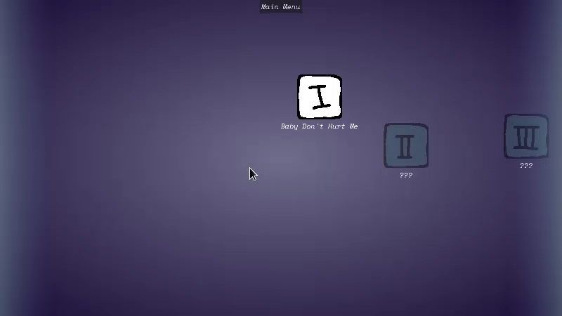
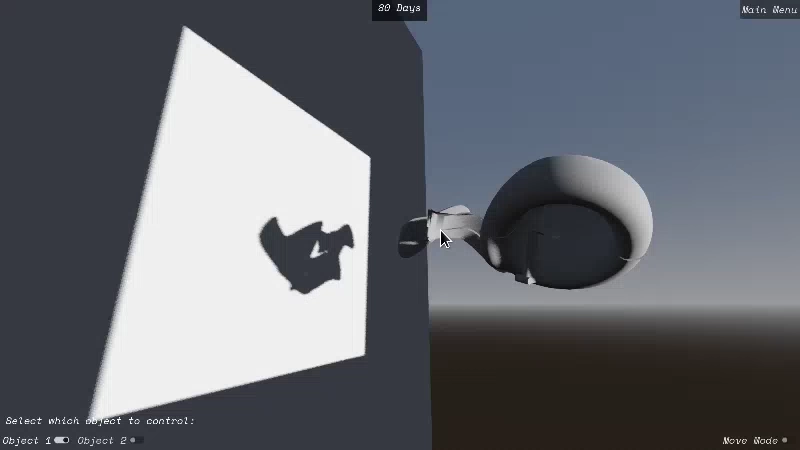

# in-the-shadows
In the shadows is a videogame project. The original task was created in School 42. I used Godot as my engine of choice with C# as the programming language, to refresh my Godot knowledge and to discover and learn C#.

## Game synopsis
You need to rotate and move around different 3D objects in order to make their shadows appear as the silhouettes that are asked for in each level. Of course, the level names are quite cryptic to make the task a little less obvious.

<i>A simple level with only horizontal rotations   </i>

<i>A harder level with two independent objects   </i>

## Technical side
The project currently has six playable levels, but adding more is quite simple. Put the level's name in the appropriate array within the `Settings.cs`. Then create the required 3D model with the correct silhouette, placing it in a wrapper analogous to what other "MeshScenes" are (see [the folder of the same name](Scenes/MeshScenes/) under `Scenes/`). Add its path to the appropriate field in the new Level object you created in the Main 3D scene. Enter the valid solution coordinates (and the acceptable margins!) into the appropriate field in the Level object. Levels can also consist of multiple models; in that case, also specify the positional offsets between elements. To make the level accesible via the level selection menu (`BeautifulLevelMenu.tscn`), create a corresponding button there and position it as needed, setting its `LevelNumber` parameter to match the one in the `Settings.cs`'s array.

On-screen level "debug" information can be enabled via the `LabelDebug` node in the main 3D scene. By default, it should display object offset, and is easily configurable through code (`LabelDebug.cs`).

_Sidenote: the project relies on Godot-style signals implemented as C# events. After adding new signal subscriptions in code, make sure to also add unsubscribing via the `-=` operator (the `_ExitTree` function of the node is a good place to start). Disconnecting signals during node destruction prevents seemingly illogical and hard-to-trace bugs when reconnecting the same signals in the future._
